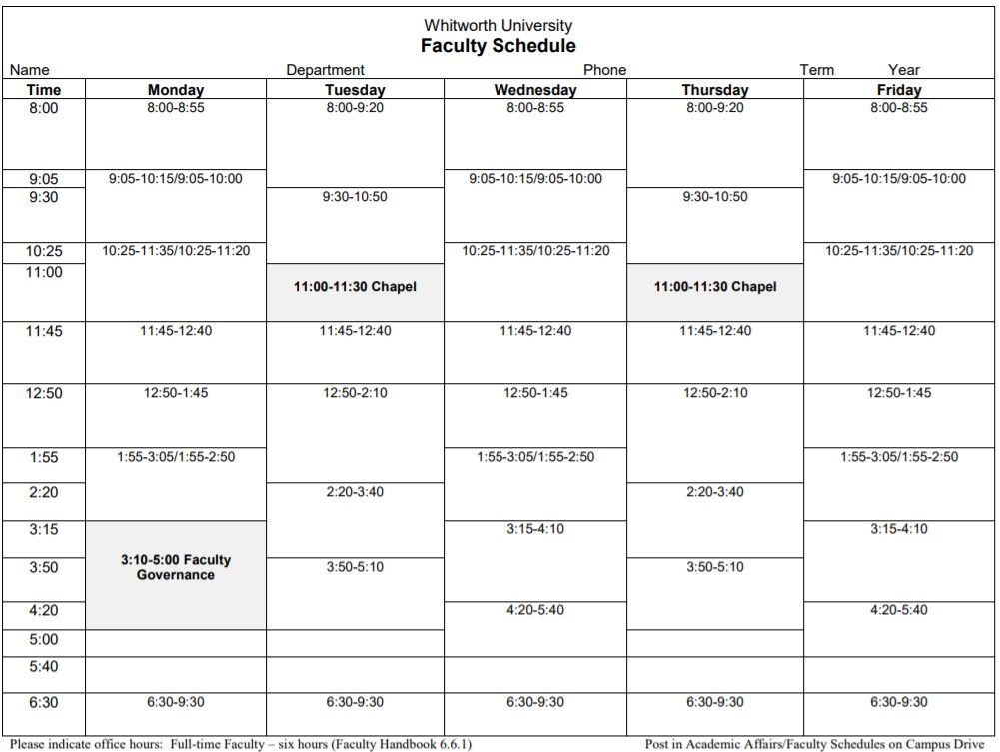

# Graph Coloring - Academic Scheduling for CS/Math Departments

## Goal: Determine if both the Math and CS departments can offer every course in a single semester, using the faculty calendar.

In total, there are 14 available timeslots across each set of days, excluding evening slots. 

Each timeslot can beseen as its own "color" in the graph coloring idea. If MWF at 8am is red, MWF at 9:05 can be considered green, and MWF at 10:25 can be considered blue. This is used to eliminate concurrent classes from being at the same time on the same set of days.

We have organized these timeslots by preferences, essentially opting for 10am-12am start times as often as possible, then moving to 8am-10am, finishing with 1pm-4pm start times to emphasize using the afternoon/evenings for student employment. 

## How it works

## Data

We have two different algorithms that use the same input.

The first input has to do with collecting class information. The class code, class name, and the professor. After importing and storing that information in a cell-by-cell organization, we can begin creating relationships.

Relationships can be categorized in two ways: 
1. Frequent concurrent enrollment
2. Professor matching

The first is fairly simple. If two classes have been historically taken together in the same semester, we create a relationship.

The second qualification for a relationship is just as simple. If two classes have the same professor teaching the class, add a relationship. This ensures that a professor won't be in two places at once.

## Applications
## Algorithm 1: Simple Greedy

The greedy approach to this problem is very straightforward. 

Visit the first node, and "color it" with the first timeslot. Visit the next uncolored node. 

For all relative nodes to the current node, mark their timeslots as unavailable. 

Color the current node with the first available timeslot. Visit the next uncolored node. Repeat until all nodes have a timeslot.

## Algorithm 2: Welsh Powell

The Welsh Powell Algorithm is similar to the greedy algorithm, but focuses on coloring based on the degree of nodes.

Store all the nodes in a priority queue based on their degree.

Pop the highest degree node off of the queue and "color it" with the current timeslot.

For each node left in the queue that does not have a timeslot and is not adjacent to a node with the current timeslot, assign the current timeslot to the node and remove it from the queue.

Set the current timeslot to a new timeslot that has not yet been used.

Repeat the above process until all nodes have a timeslot.

# Works Cited

Greedy Algorithm - https://iq.opengenus.org/graph-colouring-greedy-algorithm/

Welsh Powell - https://iq.opengenus.org/welsh-powell-algorithm/
